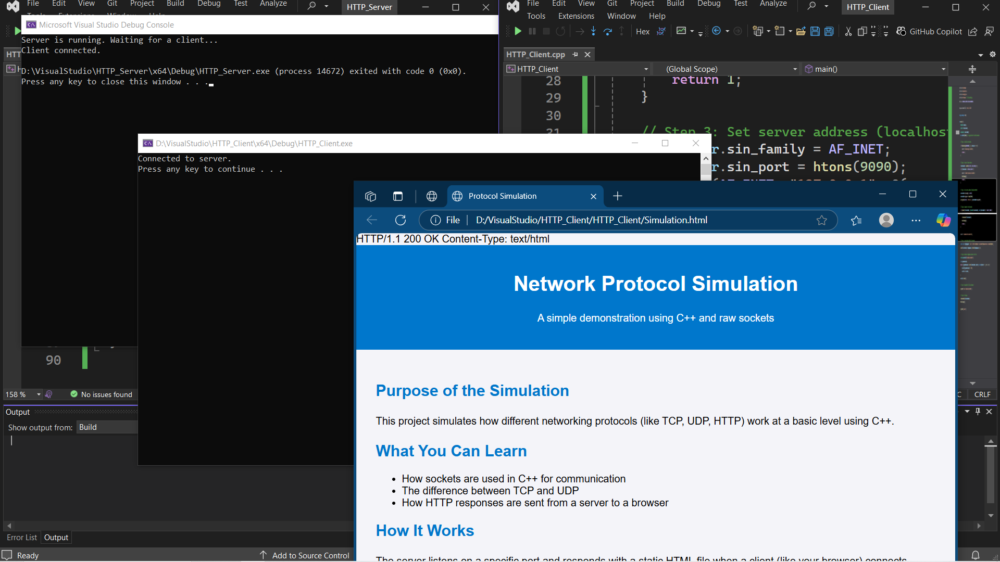

# HTTP Simulation

This is a basic simulation of the **Hypertext Transfer Protocol (HTTP)**. It demonstrates how the connection setup, data transfer, and connection teardown work in HTTP using a simple HTML file transfer example.



## How to Run the Simulation

### 1. **HTTP Server**
   - Compile the Server:
     ```bash
     g++ HTTP/HTTP_Server.cpp -o Server
     ```
   - Run the Server:
     ```bash
     ./Server
     ```

### 2. **HTTP Client**
   - Compile the Client:
     ```bash
     g++ HTTP/HTTP_Client.cpp -o Client
     ```
   - Run the Client:
     ```bash
     ./Client
     ```

> Make sure the file `Simulation.html` is placed in the same directory as the server executable before running.

## Contributions
Feel free to fork and contribute by adding more protocols or improving the current implementation.

## License
MIT License
